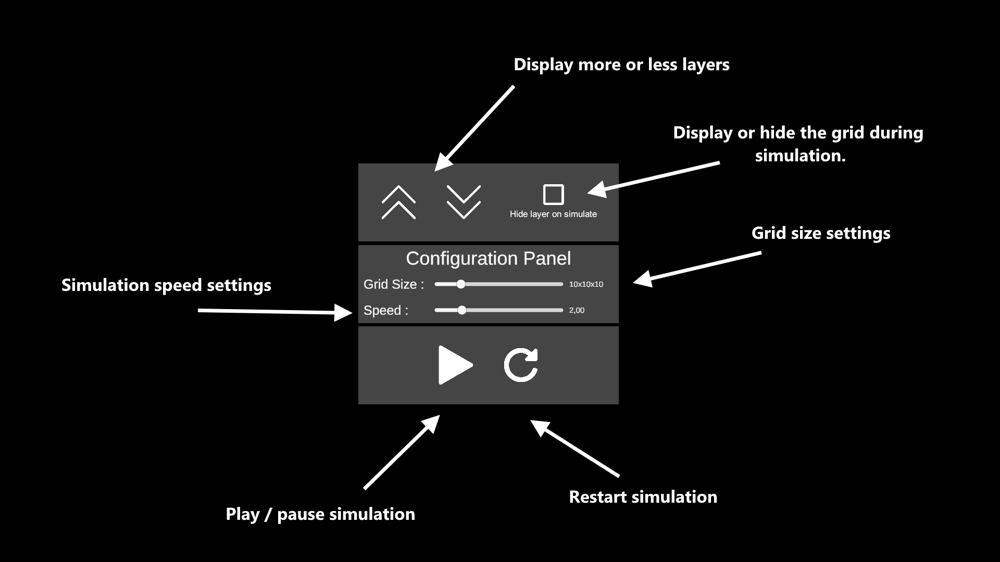
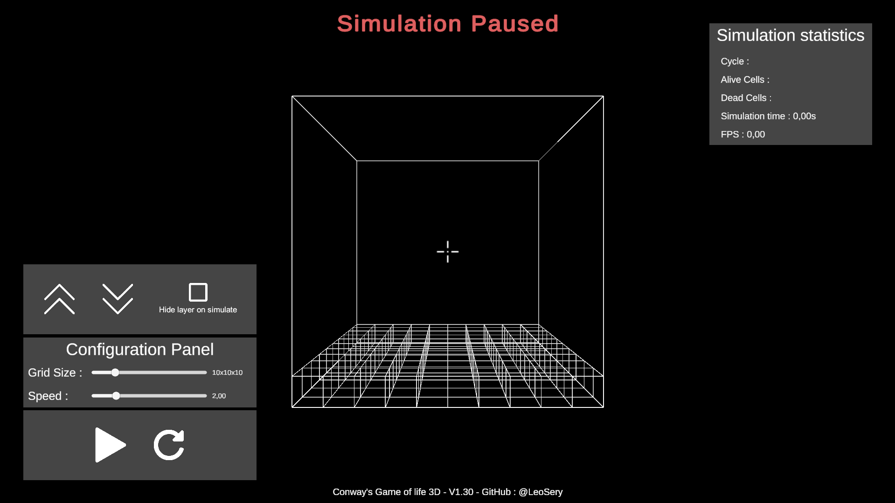
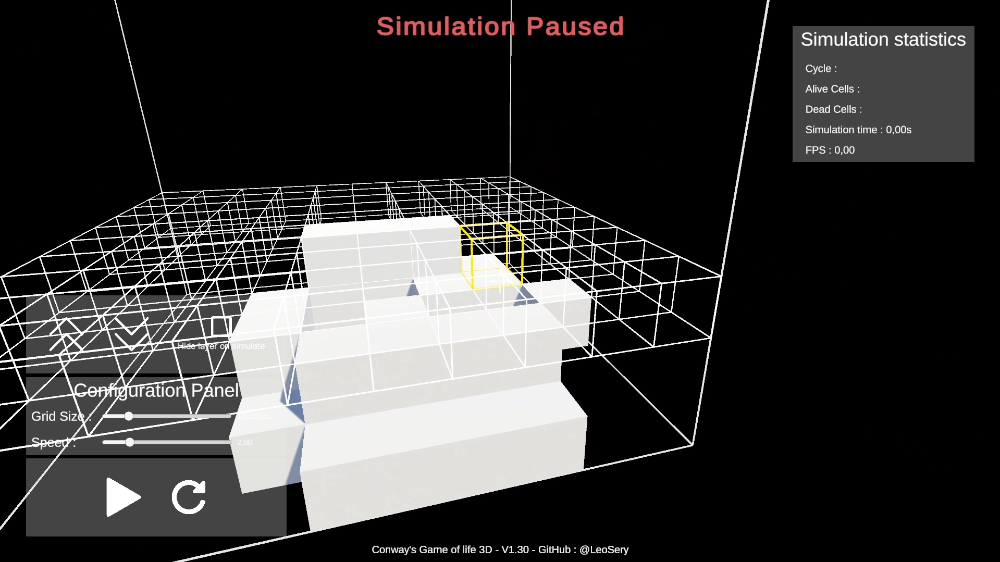
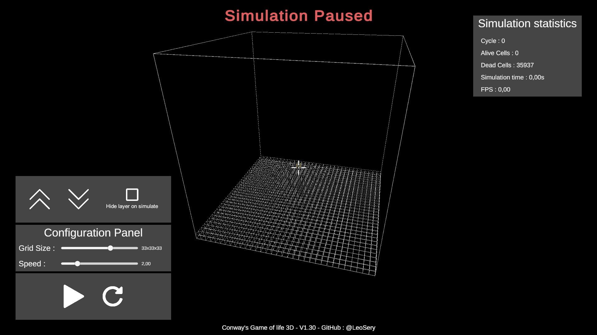
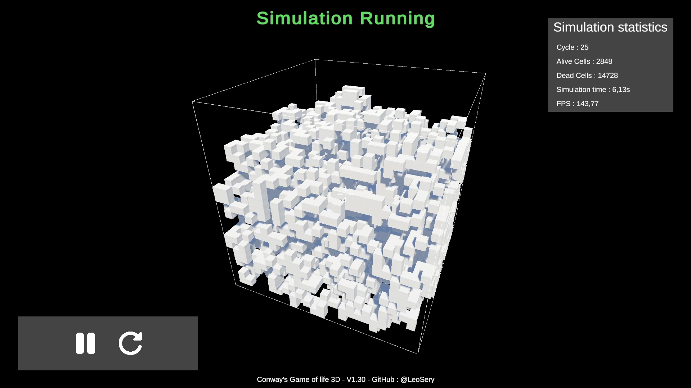

# Game-of-Life-3D--Unity3D-2024

This project is a 3D implementation of Conway's Game of Life, realized in C# with Unity. It's a cellular automaton simulation where cells evolve in a 3D space according to simple rules, generating patterns over the course of iterations. The user can interact with the grid in real time, adding or deleting cells, adjusting simulation speed and exploring 3D space with a free-form camera. The project focuses on performance and optimization.


## Summary

- [Project pitch](#project-pitch)
- [Game Rules](#game-rules)
- [Project pictures](#project-pictures)
- [Technical Section](#technical-section)
- [How to play the demo](#how-to-play-the-demo)

## Project pitch

This project implements a 3D version of Conway's Game of Life using Unity and C#.

More information about “*Conway's Game of Life*” [Here](https://en.wikipedia.org/wiki/Conway%27s_Game_of_Life) : 

Features included :

- Interactive 3D grid with adjustable size (5x5x5 to 50x50x50)
- User interface to control simulation (pause, speed, reset)
- Free camera to explore the grid
- Real-time interaction (adding/deleting cells) via a highlight system
- Statistics display (cycles, live/dead cells, FPS)

The project focuses on performance, optimization and scalability.

- Controls :

    Moving :
    - Moving forward > `Z`
    - Moving Left > `Q`
    - Moving backwards > `S`
    - Moving Right > `D`

    Camera :
    - Rotate camera > `Mouse`

    Cells :
    - Place > `Right click`
    - Destroy > `Left click`

    Grid (using the in-game UI or) :
    - Show more layers > `Left Shift`
    - Show less layer > `Left CTRL`

    Simulation control (Using the in-game UI) : 
    
    

## Game Rules

The project offers three variants of rules for the Game of Life in 3D, following the established naming convention used by the Conway's Game of Life community. The rule notation "Life XXXX (By/Sz-w)" uses the format where:
- B (Birth): The number of neighbors needed for a dead cell to become alive
- S (Survival): The range of neighbors needed for a live cell to stay alive

You can select between these rule sets:

1. **Life 5766 (B6/S5-7)** - Default rule, offering the most balanced experience
   - A cell is born if it has exactly 6 living neighbors
   - A cell survives if it has between 5 and 7 living neighbors

2. **Life 4555 (B5/S4-5)** - Recommended alternative variant
   - A cell is born if it has exactly 5 living neighbors
   - A cell survives if it has 4 or 5 living neighbors

3. **Life 4644 (B4/S4-6)** - Original rule of the project
   - A cell is born if it has exactly 4 living neighbors
   - A cell survives if it has between 4 and 6 living neighbors

### Rule Selection

- **In the Unity editor**: You can directly select which rule set to use via the GameManager component's "Selected Rule" dropdown.
  
- **In the built application**: The rule selection is set to "Auto" mode, which automatically selects the most appropriate rule based on your current grid size:
  - Small grids (5-15): Uses Life 4644 for more active patterns in limited space
  - Medium grids (16-30): Uses Life 4555 for balanced growth and stability
  - Large grids (31-50): Uses Life 5766 for controlled growth and better performance

Each set of rules produces different emergent behaviors and unique structures, so experimenting with different rules on various grid sizes can lead to fascinating discoveries.

## Project pictures










## Technical Section 

In this section, we'll delve into some of the key technical aspects of my 3D Game of Life implementation. We'll focus on three crucial elements that showcase our approach to performance optimization and 3D space management.

### 1. Efficient Cell State Management

We use a static class to define cell states, which allows for clear and efficient state management :

```csharp
public static class CellState
{
    public const byte Dead = 0;
    public const byte Alive = 1;
    public const byte ActiveZone = 2;
}
```

This approach offers several advantages:

- It provides a clear, centralized definition of `cell states`.
- Using `byte` type and constants ensures minimal memory usage and fast comparisons.
- The `ActiveZone` state helps optimize grid updates by focusing only on areas where changes can occur.

### 2. Optimized 3D Grid Structure

The core of our 3D grid is implemented with careful consideration for performance :

```csharp
private readonly HashSet<int3> activeCells;
private readonly Dictionary<int3, byte> cellStates;

private static readonly int3[] neighborOffsets =
{
    new(-1, -1, -1), new(-1, -1, 0), new(-1, -1, 1),
    new(-1, 0, -1),  new(-1, 0, 0),  new(-1, 0, 1),
    new(-1, 1, -1),  new(-1, 1, 0),  new(-1, 1, 1),
    new(0, -1, -1),  new(0, -1, 0),  new(0, -1, 1),
    new(0, 0, -1),                   new(0, 0, 1),
    new(0, 1, -1),   new(0, 1, 0),   new(0, 1, 1),
    new(1, -1, -1),  new(1, -1, 0),  new(1, -1, 1),
    new(1, 0, -1),   new(1, 0, 0),   new(1, 0, 1),
    new(1, 1, -1),   new(1, 1, 0),   new(1, 1, 1)
};
```

Key points about this implementation :

- `HashSet<int3>` for `activeCells` allows for fast lookups and ensures unique entries.
- `Dictionary<int3, byte>` for `cellState` provides quick state access for each cell.
- The `neighborOffsets` array pre-computes all possible neighbor positions, optimizing neighbor checks in 3D space.
- Using `int3` (from *Unity.Mathematics*) for positions enables efficient 3D coordinate handling.

### 3. Object Pooling System

To handle the frequent creation and destruction of cells, we implemented an object pooling system:

```csharp
public class CellPool : MonoBehaviour
{
    private Queue<GameObject> inactiveObjects;
    private HashSet<GameObject> activeObjects;
    private int defaultPoolSize;
    private int maxPoolSize;
}
```

Key features of our pooling system:

#### Adaptive Pool Sizing
The pool automatically adjusts its size based on the grid dimensions:

```csharp
int baseSize = 100;
float percentage = Mathf.Lerp(0.25f, 0.05f, Mathf.InverseLerp(5, 50, _gridSize));
int calculatedSize = baseSize + Mathf.CeilToInt(Mathf.Pow(_gridSize, 3) * percentage);
defaultPoolSize = Mathf.Clamp(calculatedSize, 100, 3000);
```

This approach:
- Starts with a base size of 100 objects
- Calculates additional capacity based on grid volume
- Adjusts percentage based on grid size (25% for small grids, scaling down to 5% for larger ones)
- Enforces minimum and maximum pool sizes

#### Efficient Object Management
The pool uses a dual-collection system:
- `Queue<GameObject>` for inactive objects enables fast FIFO operations
- `HashSet<GameObject>` for active objects ensures quick lookups and unique entries

#### Dynamic Pool Extension
The pool can grow dynamically when needed:
```csharp
if (inactiveObjects.Count == 0)
{
    if (TotalCount >= maxPoolSize)
    {
        maxPoolSize = Mathf.Min(maxPoolSize + 100, defaultPoolSize * 2);
    }
}
```
This allows:
- Gradual pool growth based on demand
- Prevention of excessive memory allocation
- Hard cap at twice the default size

#### Performance Optimization
The system includes several optimizations:
- Batch initialization of objects to spread the instantiation cost
- Automatic object recycling to minimize garbage collection
- Pool usage monitoring and statistics tracking
- Pre-warming system to avoid runtime stuttering

#### Optimization Results

| Grid Size   | Metric          | Before Optimizations | After Complete Optimizations |
|------------|-----------------|-------------------|---------------------------|
| 10x10x10   | Average FPS     | 70-90             | Editor: 300+ (never below 144)<br>Build: ~900 FPS |
|            | FPS Drops       | Frequent down to 40 | Completely eliminated      |
|            | Memory Usage    | Unpredictable GC spikes | Constant and controlled  |
| 20x20x20   | Average FPS     | 50-70             | Editor: 300+ (never below 144)<br>Build: ~900 FPS |
|            | FPS Drops       | Severe down to 30  | Completely eliminated |
|            | Memory Usage    | Heavy GC impact    | Efficient management without spikes |
| 30x30x30   | Average FPS     | `No Data`             | Editor: 250-300<br>Build: 700-800 FPS |
|            | FPS Drops       | `No Data`      | None - consistently smooth performance |
|            | Memory Usage    | `No Data`           | Controlled even over extended periods |

> **Note on Performance Testing:** During development and testing, the game reached extremely high frame rates (~900 FPS in build, 300+ FPS in editor). However, the final version has VSync enabled, capping the frame rate at 144 FPS for most displays, as rendering at higher framerates provides no visual benefit and unnecessarily consumes system resources.

#### Test Configuration

Tests were conducted on the following system:
- CPU: Intel Core i7-10750H @ 2.60Ghz (12 CPUs)
- GPU: NVIDIA GeForce RTX 2060 6Go
- RAM: 16Go DDR4
- OS: Windows 11 64-bit
- Unity Version: 6000.0.34f1

## How to download the game

The game is available on windows `(x64)` [here](https://github.com/LeoSery/Conway-s-Game-of-Life-3D--Unity3D-2024/releases) 